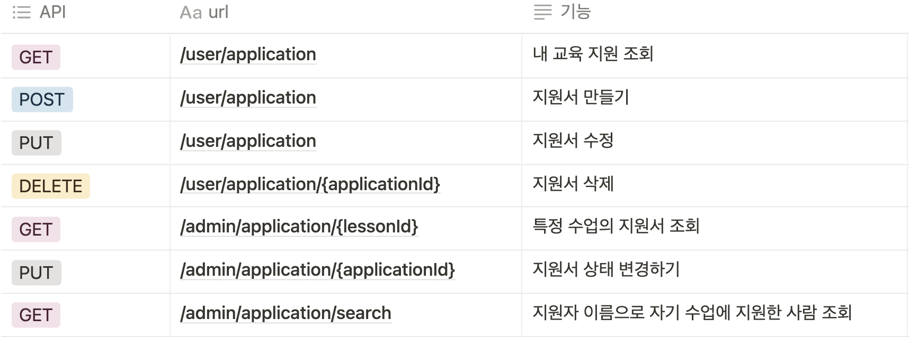

## STARTERS 취업부트캠프 2기 중간평가(JAVA)
- 로그인 / 회원가입은 따로 구현 X
- 관리자와 일반 회원
- 회원정보 - ID, 비밀번호, 회원이름, 회원구부느 전화번호
- 수업 생성은 구현 X, 생성되어있는 수업
- 수업은 수업명, 모집기간 수강 기간
- 수업별로 지원서 접수받을 수 있으며
- 지원서 기본값 - 회원이름, 아이디, 전화번호, 지원동기, 추후 진로, 상태값
- 지원서 상태값 - 지원중, 지원완료, 합격, 불합격


## 기능 요구 사항
- [x] 공통 `(+20/-20), 부분점수, 각 문항 당`
  - [x] Class Diagram 작성
  - [x] E-R Diagram 작성
  - [x] API 명세서 작성
- 일반회원
  - [x] `(+20/-20)` 회원은 최대 5개의 지원서를 작성할 수 있습니다.
    - [x] `(+20/-10)` 수업 별 중복 지원서가 존재할 수 있으며, 최종 지원완료 지원서는 1개만 존재할 수 있습니다.
    - [x] `(+20/-10)` 수업의 모집기간 내에만 지원서를 작성할 수 있으며, 모집기간 전후로 지원서 작성은 불가합니다
  - [x] `(+20/-20)`  지원서는 지원 중, 지원완료, 합격, 불합격 총 4가지로 상태값을 관리합니다.
    - [x] `(+20/-10)` 지원 중일때는 임시저장 상태로 일반회원이 지원완료 전까지 수정이 가능합니다.
    - [x] `(+20/-10)` 지원완료 상태는 지원서 제출 이후 수정, 삭제가 불가능 합니다.
  - [x] `(+20/-20)` 모집기간이 종료될 경우 지원 중의 지원서는 불합격으로 변경됩니다.
    - [x] `(+20/-10)` 지원서 상태값이 불합격으로 변경된 경우 지원서 개수로 카운팅 하지 않습니다.
    - [x] `선택` 모집기간이 동일한 수업에는 3개 이상의 지원서를 지원완료 할 수 없습니다.
    - [x] `선택` 교육기간이 동일한 수업에는 3개 이상의 지원서를 지원완료 할 수 없습니다.
- 관리자
  - [x] `(+20/-10)` 관리자 회원은 각 회원 별 지원서의 상태를 확인할 수 있습니다. (지원 중, 지원완료)
  - [x] `(+20/-10)` 지원완료된 지원서의 경우 지원서 내용 및 합격/불합격 상태값 변경이 가능합니다.
  -[x]  `선택` 완료된 지원서는 회원이름으로 검색이 가능합니다.


## ERD
- 한 수업에 중복지원서가 있을 수 있다해서 다대다 관계로 설정할까 헷갈렸는데
한개의 지원서는 한개의 수업에만 지원할 수 있고 한 수업은 여러개의 지원을 받을 수 있으므로
다대일 관계로 설정
- 지원서 하나는 유저 하나가 대응되므로 일대일 관계로 설정

## 추가 사항
- 데이터베이스 설정 MySQL 데이터베이스에 starter 스키마 생성 후 돌려야합니다
- 아니면 내장데이터베이스로 설정하도록 build.gradle과 properties.yml 파일을 수정해야합니다.

### 지원서
- 스프링 스케줄러를 이용해 지원중과 지원완료는 자동으로 날짜지나면 FAIL로 갱신하도록 구현했습니다.

### 수업
- 수업의 경우 최대 학생 수를 두어 인원이 가득 찰 시 추가로 신청 못받게 구현했습니다.
- 또한 어드민은 학생이 가득 찼을 때 추가로 PASS로 바꿀 수 없습니다.

### 유저
- 회원가입이나 로그인 할 수 없는 상황이므로 회원은 미리 넣어두고 1번 유저는 일반회원, 2번 유저는 어드민으로 설정했습니다.
- 또한 회원만 쓸 수 있는 API는 /user로 시작하고 어드민만 쓸 수 있는 API는 /admin으로 시작합니다.
- 인터셉터를 이용해 회원 전용 API는 미리 세션에 회원 id 넣어두고 어드민 전용 API는 어드민 id를 넣어놨습니다.
- 따라서 모든 API에서 유저정보를 단순히 세션에서 꺼내오면 되도록 설계했습니다.
- 나중에 확장 시 로그인 API에 세션정보를 넣고 인터셉터를 지우면 되도록 했습니다.
- 또한 spring security 사용할 때 회원과 어드민이 서로 접근 못하도록 URL을 분리했습니다.
- 나중에 scale-out으로 확장시에 redis를 이용해 세션 공유하면 될 것 같습니다.

### REST API
- method를 잘 활용하고 url을 명사로 지어 최대한 restful하게 api를 설계했습니다.
- user와 admin의 API를 분리했습니다.
- 요청이 성공적이었을때에는 Http status 200을 보내고 실패했을 때에는 그 외의 code와 이유가 담긴 message를 보내도록 구현햇습니다.

### 동시성
- 교육에 최대 학생 수를 두었기 때문에 동시성 문제가 발생할 수 있습니다.
- 동시성 해결 방법으로는 
  - synchronized 사용
    - 서버 한대에서 운용할때 유효
    - 단 1개의 쓰레드만 접근 가능
  - MySQL 기능 사용
    - Pessimistic Lock
    - Optimistic Lock
    - Named Lock
  - Redisson 사용
- 단순히 서버 한대이고 소규모이기에 synchronized를 이용해 동시성을 해결했습니다.

### 마무리
- 아직 예외처리를 이용해 response를 보내는 방법과 Validation에 대한 이해가 부족하여 해당 과제에 적용하지 못했습니다.
- 도커를 사용해 MySQL 데이터베이스와 직접 연동해서 과제 진행했고 시간 부족으로 인해 포스트맨으로 API 테스트를 진행했습니다.
- 단순 code와 if문으로 예외처리들을 진행했는데 시간 부족으로 enum을 이용하지 못한 점이 아쉽습니다.


## API 명세서

### Student


### `POST`   /user/application 

** 지원서 작성하기 **

- 주의사항

request

```jsx
{
  "motivation": "지원 동기 적기",
  "lessonId": 2,
  "futureCareer": "추후 진료 적기",
  "status" : "APPLYING"
}
```

response

```jsx

HttpStatus.OK 
{
  "지원서 작성 완료"
}

HttpStatus.BAD_REQUEST
{
  "지원서 작성 실패 지원서 갯수 초과"
}
or
{
  "지원서 작성 실패 모집기간이 아님"
}
or
{
  "지원서 작성 실패 지원 완료이거나 패스한게 존재"
}
or
{
  "지원서 작성 실패 글자수 초과"
}
or
{
  "지원서 작성 실패 잘못된 status (pass이거나 fail인 경우)"
}
or
{
  "지원서 작성 실패 잘못된 이미 초과된 교육입니다."
}
or
{
  "해당수업과 겹치는 지원완료 수업이 3개이상입니다."
}
or
{
  "해당수업과 모집기간이 겹치는 지원완료 수업이 3개이상입니다."
}


```

### `DELETE`  /user/application/{applicationId}

지원서 삭제하기

- 지원서 삭제하기 지원중인 경우에만 삭제 가능!

request

```jsx
{
    "applicationId" : 2 (pathvalue로 받음)
}
```

response

```jsx
// 성공시
HttpStatus.OK
{
  "삭제하였습니다."
}
// 실패시
HttpStatus.BAD_REQUEST
{
  "본인 소유의 지원서가 아니거나 지원중인 지원서가 아닙니다."
}
```

### `PUT`  /user/application

지원서 수정하기 및 제출하기

- 제출하기는 지원서의 status 수정하므로 put에 해당

request

```jsx
{
  "motivation": "지원 동기 적기",
  "lessonId": 2,
  "futureCareer": "추후 진료 적기",
  "status" : "APPLYING"
}
```

response

```jsx
// 성공시
HttpStatus.OK
{
  "수정 완료"
}
//실패시
{
  "이미 지원완료이거나 결정된 지원입니다."
}
or
{
  "잘못된 status 입니다."
}
or
{
  "글자 수가 초과되었습니다."
}
or
{
  "잘못된 요청입니다."
}
or
{
  "해당수업과 겹치는 지원완료 수업이 3개이상입니다."
}
or
{
  "해당수업과 모집기간이 겹치는 지원완료 수업이 3개이상입니다."
}
```

### `GET`  /user/application

유저 입장에서 자기가 쓴 지원서 가져오기


request

```jsx
{
  
}
```

response

```jsx
HttpStatus.OK
{
  [
      {"motivation":"motivation","futureCareer":"future career","userName":"roopre","userEmail":"benny1020@naver.com","userPhoneNum":"010-7138-2184"},
    {"motivation":"motivation","futureCareer":"future career","userName":"roopre","userEmail":"benny1020@naver.com","userPhoneNum":"010-7138-2184"},
    {"motivation":"motivation","futureCareer":"future career","userName":"roopre","userEmail":"benny1020@naver.com","userPhoneNum":"010-7138-2184"},
    {"motivation":"motivation","futureCareer":"future career","userName":"roopre","userEmail":"benny1020@naver.com","userPhoneNum":"010-7138-2184"}
  ]
}

```

### ADMIN

### `GET`  /admin/application/{lessonId}

특정 교육 지원서 조회하기

- 지원서 조회

request

```jsx
{
    "lessonId" : 2 (pathValue로 받음)
}
```

response

```jsx
{
  [
    {"motivation":"motivation","futureCareer":"future career","userName":"roopre","userEmail":"benny1020@naver.com","userPhoneNum":"010-7138-2184"},
    {"motivation":"motivation","futureCareer":"future career","userName":"roopre","userEmail":"benny1020@naver.com","userPhoneNum":"010-7138-2184"},
    {"motivation":"motivation","futureCareer":"future career","userName":"roopre","userEmail":"benny1020@naver.com","userPhoneNum":"010-7138-2184"},
    {"motivation":"motivation","futureCareer":"future career","userName":"roopre","userEmail":"benny1020@naver.com","userPhoneNum":"010-7138-2184"}
  ]
}
```

### `PUT`  /admin/application/{applicationId}

지원서 상태 변경하기

- 지원완료된 지원서중 합격 / 불합격 변경하기

request

```jsx
{
  "applicationId" : 1 (pathvalue로 받음)
  "status" : 1,
}
```

response

```jsx
성공시
HttpStatus.OK 
{
  "status 수정 성공"
}

실패시
HttpStatus.BAD_REQUEST
{
  "더이상 학생을 받아들일 수 없습니다."
}
```

### `GET`  /admin/application/

이름으로 지원서 조회

- 특정 교육에 지원한 사람들 중 이름으로 지원서 조회

request

```jsx
{
  "lessonId" : 1,
  "userName" : "roopre"
}
```

response

```jsx
성공시
HttpStatus.OK 
{
  {"motivation":"motivation","futureCareer":"future career","userName":"roopre","userEmail":"benny1020@naver.com","userPhoneNum":"010-7138-2184"}
}

```